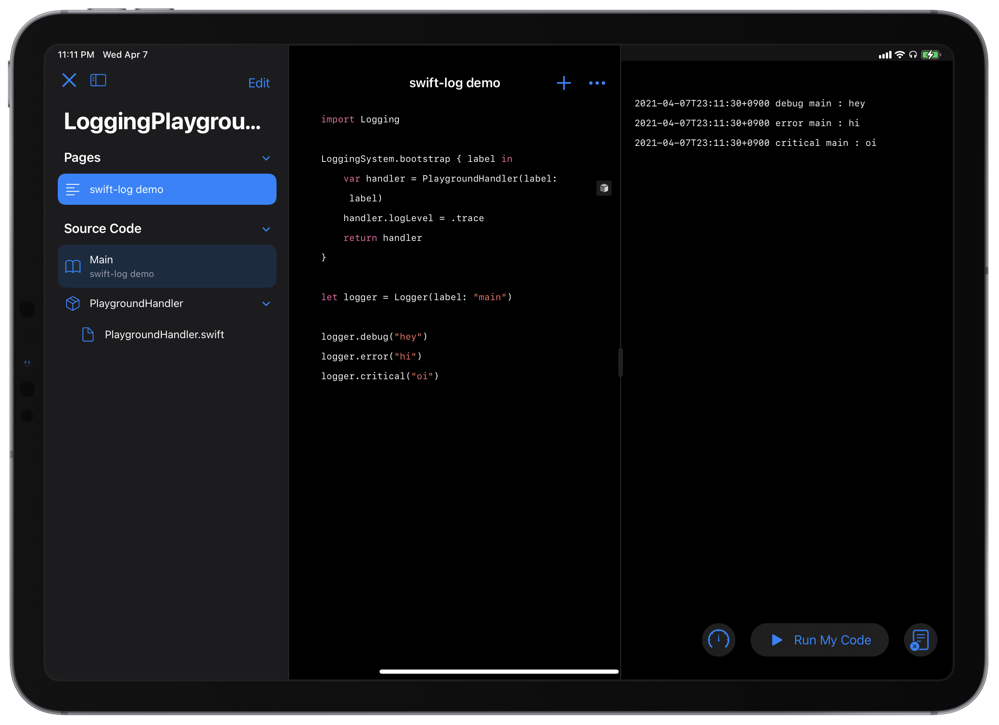

# LoggingPlayground

This playground is a proof-of-concept that uses [SwiftLog](https://github.com/apple/swift-log) on [Swift Playgrounds](https://apps.apple.com/jp/app/swift-playgrounds/id908519492?l=en).

## Get Started

1. Clone this repository **recursively**
    - I recommend you to use [Working Copy](https://workingcopyapp.com) since it supports Git submodules.
2. Open LoggingPlayground.playgroundbook in the Swift Playgrounds app
